# 🚀 PDF RAG Token Analysis System

A complete Retrieval-Augmented Generation (RAG) pipeline that transforms PDF policy documents into an intelligent semantic search system. Built using spec-driven development methodology with Kiro AI.

## 🎯 Project Overview

This system demonstrates a production-ready RAG pipeline that:
- Processes multiple PDF documents with robust error handling
- Performs advanced token analysis and normalization (60% noise reduction)
- Generates semantic embeddings using transformer models
- Stores embeddings in a vector database for similarity search
- Provides comprehensive visualizations and educational content

## 📊 Key Results

- **60% noise reduction** through intelligent normalization
- **Complete semantic search** with transformer-based embeddings
- **Production-ready pipeline** with modular, testable components

## 🏗️ Architecture

```mermaid
graph TD
    A[📄 PDF Documents] --> B[🔍 Text Extraction]
    B --> C[🔤 Tokenization]
    C --> D[📊 Token Analysis & Visualization]
    D --> E[🧹 Token Normalization]
    E --> F[📈 Before/After Comparison]
    F --> G[🤖 Embedding Generation]
    G --> H[📊 Embedding Visualization]
    H --> I[🗄️ Vector Database Storage]
    I --> J[🔍 Semantic Search Testing]
    J --> K[✅ Complete RAG System]
```



## 🚀 Quick Start

### Prerequisites
- Python 3.8+
- Jupyter Notebook or JupyterLab

### Installation

1. **Clone the repository**
   ```bash
   git clone https://github.com/yourusername/pdf-rag-token-analysis.git
   cd pdf-rag-token-analysis
   ```

2. **Install dependencies**
   ```bash
   pip install -r requirements.txt
   ```

3. **Add your PDF documents**
   - Place PDF files in the `Policy_Files/` directory
   - The system will automatically process all `.pdf` files in this folder

4. **Run the notebook**
   ```bash
   jupyter notebook pdf_rag_token_analysis.ipynb
   ```


### Key Features
- **Robust PDF Processing**: Handles corrupted files gracefully
- **Smart Tokenization**: Estimates token counts for LLM compatibility
- **Advanced Normalization**: Removes noise while preserving meaning
- **Semantic Embeddings**: Uses sentence-transformers for high-quality vectors
- **Comprehensive Visualization**: Before/after comparisons and analytics
- **Educational**: Detailed explanations of each pipeline step


## 🛠️ Technology Stack

- **PDF Processing**: PyPDF2
- **Data Analysis**: pandas, numpy
- **Visualization**: matplotlib, seaborn
- **Machine Learning**: scikit-learn, sentence-transformers
- **Vector Database**: ChromaDB
- **Development**: Jupyter notebooks

## 📚 Spec-Driven Development

This project was built using Kiro's spec-driven methodology:

1. **Requirements Phase**: 7 detailed user stories with EARS acceptance criteria
2. **Design Phase**: Modular architecture following SOLID principles
3. **Implementation Phase**: 13 incremental tasks with validation

See the `.kiro/specs/` directory for complete documentation.

## 🔍 Usage Examples

### Basic Pipeline Execution
```python
# Initialize components
config = ConfigManager()
pdf_processor = PDFProcessor(config)
tokenizer = Tokenizer(config)

# Process documents
documents = pdf_processor.load_pdfs()
tokens = tokenizer.tokenize(documents)

# Normalize and analyze
normalizer = TokenNormalizer()
normalized_tokens = normalizer.normalize_tokens(tokens)
```

### Semantic Search
```python
# Generate embeddings
embedding_generator = EmbeddingGenerator(config)
embeddings = embedding_generator.generate_embeddings(normalized_tokens)

# Store in vector database
vector_db = VectorDBManager()
vector_db.store_embeddings(embeddings)

# Search for similar content
results = vector_db.search_similar(query_embedding, top_k=5)
```

## 📄 License

This project is licensed under the MIT License - see the [LICENSE](LICENSE) file for details.

## 🙏 Acknowledgments

- Built with [Kiro AI](https://kiro.ai) using spec-driven development
- Sentence Transformers for high-quality embeddings
- ChromaDB for efficient vector storage
- The open-source Python ecosystem

## 📞 Contact

For questions about this implementation or consulting opportunities:
- Create an issue in this repository
- Connect on LinkedIn: https://www.linkedin.com/in/karthik-chekuri-845921350/

---

**⭐ If this project helped you understand RAG systems, please give it a star!**# 🚀 PDF RAG Token Analysis System
